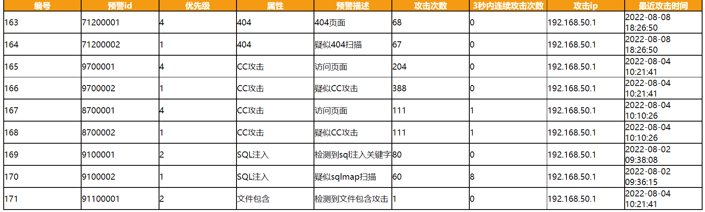
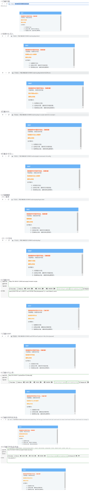

#### 代码层级WAF原型

先简单写一下，后续有时间再补充

##### 一、简介：

css目录存放样式

htnl目录存放警示页面

php目录存放代码

vul目录存放有WEB漏洞的页面，用来验证

yaml目录存放规则库

##### 二、使用方法：

1.再要保护的php文件，加上

```
include "../php/Web.php";
$a=new GetMethod($conf_get_array,$_SERVER);
$b=new POSTHeadMethod($conf_post_array,file_get_contents('php://input'),getallheaders());
```

2.创建数据库

```
create database  if not exists WAF charset utf8 ;
use WAF;
CREATE TABLE `waf` (
  `id` int(11) NOT NULL AUTO_INCREMENT,
  `rid` int(11) DEFAULT NULL,
  `priority` int(11) DEFAULT NULL,
  `attribute` varchar(255) DEFAULT NULL,
  `description` varchar(255) DEFAULT NULL,
  `times` int(11) DEFAULT NULL,
  `secondtimes` int(11) DEFAULT NULL,
  `src` varchar(255) DEFAULT NULL,
  `time` datetime DEFAULT NULL,
  `rule` varchar(1000) DEFAULT NULL,
  PRIMARY KEY (`id`)
) ENGINE=InnoDB DEFAULT CHARSET=utf8

```

3.对于404的检测，是需要先修改httpd.conf设置项重定向到404.php

```
ErrorDocument 404 /WAF/php/404.php
```

4.访问后台admin.php,既可以看到详情



##### 三、前端警示效果



